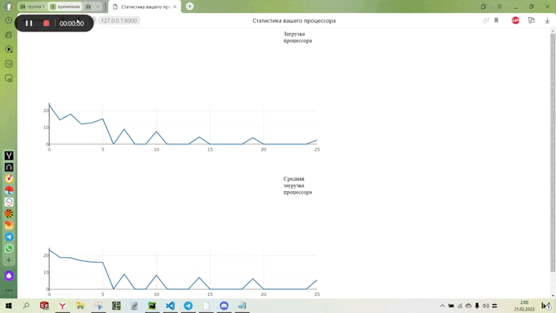

__Проект по отоброжению графиков Загрузки процессора и Средней загрузки процессора за минуту.__

_Стэк:_ 
* Python3
* Django
* Django Channels
* sqlite
* js

В процессе анализа возможностей Django было принято решение о реализации проекта c помощью
WebSocket протокола. Данный протокод обеспечил постоянное соедение с сервером и позволил обновлять
данные состояния процессора "в прямом эфире".

**Запуск проекта:**
    1. Через терминал разверните виртуальное окружение:
            python -m venv venv

    2. Находясь в корневой директории проекта (cpu_stats) активируйте в.о.(Команда для Windows):
            source venv/Scripts/activate

    3. После того как активируете новое виртуальное окружение, выполните команду
       для установки всех расширений:
            pip install -r requirements.txt

    4. Запустите сервер:
            python manage.py runserver

    !  Обратите внимание что сервис работает ровно одну минуту затем останавливается
       время работы программы можно изменить в settings.py константа TIME_OF_WORK

    !! Не обновляйте страницу пока в терминале будет закрыто соединение с сокетом. ___(WebSocket DISCONNECT /ws-url/ [127.0.0.1:60856]___
)

В Django Channels работа сервиса описывается в файле consumers.py (аналог views.py Django).
Consumer'ы структурируют ваш код как серию функций, вызываемых всякий раз, когда происходит событие,
вместо того, чтобы заставлять вас писать цикл событий. В моем случае эту работу берет на себе синхронный
"потребитель" class WSConsumer(WebsocketConsumer)

__def connect(self)__ - Главная  функция, она организует поделючение к WebSocket'у и расчеты значений графиков.

___Вложенные функции:___

* __delete_old_stats()__ - Удаляет данные из БД старше константы TIME_SLICE (меняется в settings.py). По заданию параметр 1 час.

* __continue_after_pause(close_socket_time)__ - Данный метод добавляет в бд пустые записи, чтобы после восстановления работы сервиса на графике отображались моменты "простоя".

* __cpu_percent()__ - Функция библиотеки psutil, Возвращает число float, представляющее
        текущую загрузку ЦП в масштабе всей системы в процентах.

* __avg_count(stat_list)__ - Функция рассчитывает среднюю величину загрузки процессора, за минуту используя данные из массива, наполненного данными cpu_percent().

    FrontEnd часть реализована с помощью plotly для js.

